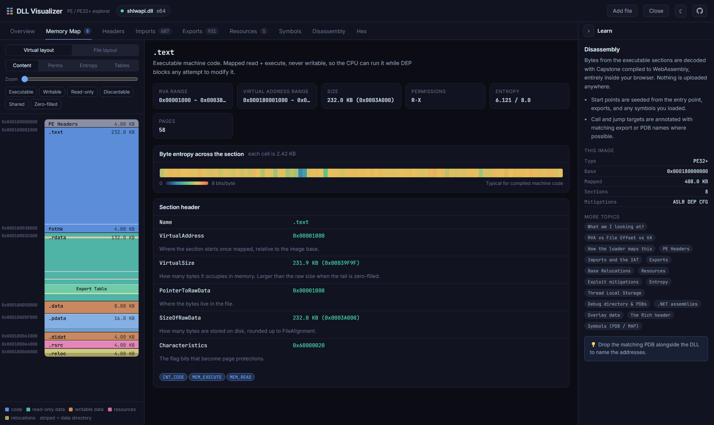
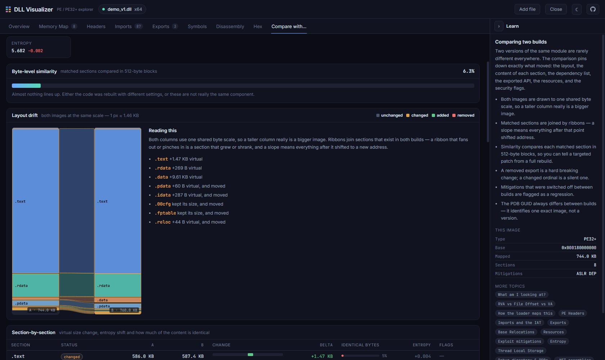

# DLL Visualizer

**[Try it live →](https://vineeththomasalex.github.io/dll-visualizer/)**

See inside a Windows binary. Drop a `.dll`, `.exe` or `.sys` and get the exact layout the Windows
loader will build in memory — colour-coded sections, every header field explained, imports and
exports grouped by what they actually do, the resource tree, and a live disassembly.

Everything runs in your browser. No upload, no server, no telemetry.



## What it does

**Memory map** — the image rendered as a single proportional block. Each section is a band sized by
its virtual footprint, with data-directory tables painted on top as striped overlays. Toggle between
the *virtual* layout (what the loader builds) and the *file* layout (what is on disk) to see exactly
where alignment padding, the Authenticode signature and any overlay data live. Recolour by content,
page permissions, or byte entropy, and filter to just the executable, writable, discardable or
zero-filled regions.

**Explained headers** — every field of the DOS header, Rich header, COFF header, optional header,
all 16 data directories, the load config, the debug directory, TLS and the certificate table, each
with its file offset, decoded value, and a plain-English note on what the loader does with it.
Characteristics and DllCharacteristics are broken out bit by bit.

**Imports & exports** — imports grouped by module *and* by purpose (file I/O, registry, networking,
crypto, process control, ETW, NT native API…), with the IAT slot for every function. Exports show
the ordinal, RVA, and any forwarder strings. Delay-loaded modules are flagged.

**Resources** — the full three-level type → name → language tree, plus a properly parsed
`VS_VERSIONINFO` block.

**Symbols** — drop the matching `.pdb` and the app parses the MSF container, the DBI stream and the
public symbol records directly in the browser, then checks the PDB's GUID and age against the
image's debug directory so you know the symbols really belong to this build. Linker `.map` files
work too.

**Disassembly** — Capstone compiled to WebAssembly, lazily loaded, seeded from the entry point, TLS
callbacks, exports and your PDB symbols. Branch targets are annotated with matching names and are
clickable to follow.

**Security posture** — ASLR, DEP, CFG, SafeSEH, high-entropy VA, signing, and W+X detection, with
the risky combinations called out rather than just listed.

**Hex** — a virtualised hex view where offset colours match the file-layout map, so you always know
which structure you are standing in.

**Compare with…** — add a second build of the same DLL and get a single scrollable diff. Both images
are drawn to one shared byte scale with matched sections joined by ribbons, so growth and address
shift are immediately visible. Alongside it: a plain-English summary of what changed, per-section
size deltas and byte-level similarity (each matched section compared in 512-byte blocks), stacked
entropy profiles showing *where inside* a section the bytes moved, metadata and version-resource
diffs, data-directory drift, dependency churn (modules and individual functions gained or dropped),
exported-API changes with breaking-change warnings for removed exports and changed ordinals,
resource diffs, and a regression flag if any security mitigation was switched off between builds.



## Supported formats

PE32 and PE32+ for x86, x64, ARM and ARM64, including .NET assemblies (the COR20 header and CLI
metadata streams are decoded). Disassembly is available for x86, x64, ARM and ARM64 images.

## Running locally

```bash
npm install
npm run dev
```

Then open http://localhost:5173/dll-visualizer/.

```bash
npm run build     # type-check + production build into dist/
npm run lint      # eslint
npm test          # playwright end-to-end tests
npm run deploy    # publish dist/ to the gh-pages branch
```

### Test fixtures

`npm run fixtures` builds a small native DLL in two flavours (`demo.dll` and `demo_v2.dll`, with
their PDBs and MAPs) using MSVC and copies a system DLL into `tests/fixtures/`. That folder is git-ignored — no Windows system binaries are committed to this repository. The end-to-end tests skip themselves if the fixtures are missing.

## How it works

| Piece | Where |
| --- | --- |
| PE / PE32+ parser | `src/pe/parser.ts` |
| Build-to-build diff engine | `src/pe/diff.ts` |
| Entropy analysis | `src/pe/entropy.ts` |
| PDB (MSF) + MAP readers | `src/symbols/pdb.ts` |
| Capstone wrapper | `src/disasm/disasm.ts` |
| Explanations shown in the app | `src/knowledge/glossary.ts` |

The PE parser is written from scratch against the PE/COFF specification — no binary-parsing
dependency. It is defensive throughout: every directory is parsed inside a guard that records a
warning instead of throwing, so a truncated or deliberately malformed image still renders as much as
it can.

## Built with

React 19 · TypeScript · Vite · [capstone-wasm](https://github.com/CzBiX/disasm-web) · Playwright

## Licence

MIT

